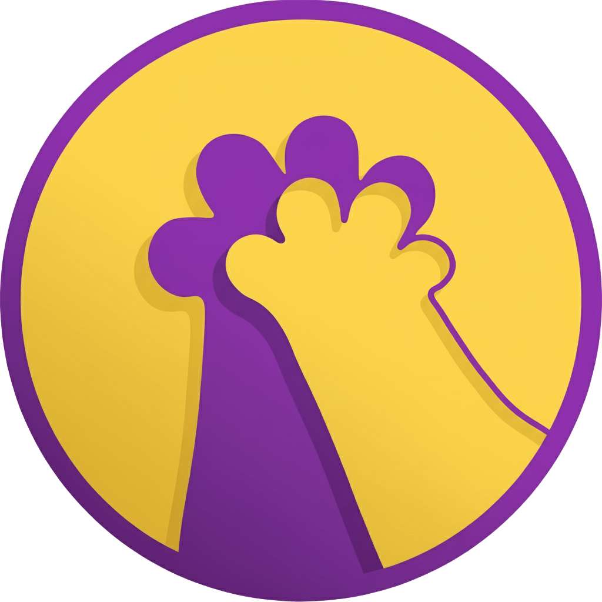

<div align="center">



# União Felina — Salvando Vidinhas

Site institucional desenvolvido em React e TypeScript para uma organização dedicada ao resgate, cuidado e adoção responsável de gatos de rua. O projeto tem como objetivo apresentar a missão, a história e as formas de contribuição da ONG por meio de uma interface responsiva, acessível e com identidade visual própria.

[](https://react.dev/)
[](https://www.typescriptlang.org/)
[](https://vite.dev/)
[](https://tailwindcss.com/)
[](https://eslint.org/)
[](#licença)

</div>

---

## Sobre o projeto

O União Felina nasceu como um projeto de portfólio com um propósito duplo: de um lado, servir como estudo prático de desenvolvimento front-end moderno com React, TypeScript, Vite e Tailwind CSS; de outro, dar forma a um site institucional completo e verossímil, como o de uma ONG real, cobrindo desde a apresentação da causa até os canais de contato e doação.

A construção do site seguiu uma lógica de página única (single page), organizada em seções bem definidas e navegáveis por âncoras, com foco em contar uma história — quem é a organização, o que ela já fez e como qualquer visitante pode se envolver — de forma clara e objetiva, sem depender de texto solto ou informação redundante.

Do ponto de vista técnico, o projeto foi estruturado em componentes reutilizáveis e tipados, com separação entre páginas e componentes de seção, e toda a estilização feita via classes utilitárias do Tailwind CSS, incluindo breakpoints responsivos para mobile, tablet e desktop.

---

## Funcionalidades

**Apresentação institucional**
Seção inicial (hero) com o nome da organização, um resumo de sua proposta e uma chamada visual para as demais seções do site.

**Missão, Visão e Valores**
Bloco dedicado a comunicar os princípios da organização, com ilustrações associadas a cada um dos três pilares.

**Impacto do trabalho**
Seção com indicadores numéricos (gatos resgatados, adoções realizadas, voluntários engajados, campanhas educativas e parcerias veterinárias), apresentados em cards, reforçando de forma objetiva os resultados alcançados.

**Linha do tempo**
Componente de timeline vertical que narra a evolução da organização ano a ano, desde a fundação até as iniciativas mais recentes, alternando o conteúdo entre os lados esquerdo e direito da linha central.

**Formas de ajudar**
Seção com múltiplos caminhos de contribuição, cada um com sua própria chamada para ação:
- Doação financeira via Pix, com botão que copia a chave automaticamente para a área de transferência
- Doação de materiais e suprimentos (ração, itens de higiene, materiais veterinários, caixas de transporte), com redirecionamento para contato via WhatsApp
- Cadastro de voluntários por meio de um formulário externo (Google Forms)
- Compartilhamento da causa nas redes sociais

**Contato**
Rodapé com informações de localização, telefone, e-mail, Instagram e um link direto para conversa no WhatsApp.

**Navegação e responsividade**
Menu fixo no topo com rolagem suave até cada seção da página. Em telas menores, o menu é substituído por um painel lateral (drawer) acionado por um ícone de menu, com animação de entrada e saída.

---

## Tecnologias utilizadas

| Tecnologia | Função no projeto |
|---|---|
| React 19 | Biblioteca principal para construção da interface e dos componentes |
| TypeScript | Tipagem estática de props, estados e dados das seções |
| Vite | Ferramenta de build e servidor de desenvolvimento |
| Tailwind CSS 4 | Estilização utilitária, responsividade e temas customizados |
| React Icons | Ícones de contato e redes sociais (WhatsApp, Instagram, telefone, e-mail, localização) |
| ESLint + typescript-eslint | Padronização e verificação de qualidade do código |

Fontes customizadas: Shrikhand, utilizada nos títulos e elementos de destaque, e Questrial, utilizada nos textos corridos. Ambas são carregadas via `@font-face` e registradas como variáveis de tema do Tailwind.

---

## Estrutura do projeto

```
uniao-felina-website/
├── public/
├── src/
│   ├── assets/
│   │   ├── fonts/              Fontes customizadas (Shrikhand, Questrial)
│   │   └── imgs/                Imagens e ilustrações utilizadas no site
│   ├── components/
│   │   ├── header.tsx           Cabeçalho, navegação e menu mobile
│   │   ├── impactDados.tsx      Seção de indicadores de impacto
│   │   ├── linhaDoTempo.tsx     Timeline com a história da organização
│   │   └── comoAjudar.tsx       Seção com as formas de contribuição
│   ├── pages/
│   │   └── home.tsx             Composição da página principal
│   ├── App.tsx                  Componente raiz da aplicação
│   ├── main.tsx                 Ponto de entrada da aplicação
│   └── index.css                Estilos globais, fontes e animações
├── index.html
├── package.json
├── vite.config.ts
├── tsconfig.json
└── README.md
```

Cada componente da pasta `components` corresponde a uma seção independente da página inicial, recebendo seus próprios dados internamente (arrays de objetos tipados), o que facilita a manutenção e a eventual migração desses dados para uma fonte externa (CMS ou API) no futuro.

---

## Como executar o projeto localmente

**Pré-requisitos:** Node.js instalado (versão 18 ou superior) e um gerenciador de pacotes (npm, incluído por padrão).

```bash
# Clonar o repositório
git clone https://github.com/JohnLouisMaker/uniao-felina-website.git

# Acessar a pasta do projeto
cd uniao-felina-website

# Instalar as dependências
npm install

# Executar o servidor de desenvolvimento
npm run dev
```

Após executar o comando acima, o projeto ficará disponível em `http://localhost:5173`.

### Scripts disponíveis

| Comando | Descrição |
|---|---|
| `npm run dev` | Inicia o servidor de desenvolvimento com hot reload |
| `npm run build` | Compila os tipos TypeScript e gera a build de produção |
| `npm run preview` | Serve localmente a build de produção gerada |
| `npm run lint` | Executa a verificação de lint em todo o projeto |

---

## Identidade visual

| Elemento | Definição |
|---|---|
| Cor primária | Roxo (`purple-600` / `purple-900`) |
| Cor de destaque | Âmbar (`amber-400`) |
| Tipografia de títulos | Shrikhand |
| Tipografia de texto | Questrial |
| Layout | Mobile-first, com breakpoints para tablet (`md`) e desktop (`lg`) |

---

## Possíveis evoluções

- Página de galeria com fotos e histórico individual dos animais resgatados
- Fluxo completo de adoção, com formulário próprio e etapas de triagem
- Área de conteúdo educativo (blog) sobre bem-estar e posse responsável de animais
- Migração dos dados estáticos das seções para um CMS ou uma API própria
- Cobertura de testes automatizados dos componentes principais

---

## Autor

Desenvolvido por [JohnLouisMaker](https://github.com/JohnLouisMaker) como projeto de portfólio, com foco em prática de front-end moderno e construção de interfaces completas a partir de um briefing institucional.

Sugestões, correções e contribuições são bem-vindas por meio de issues ou pull requests.

---

## Licença

Este projeto está disponível sob a licença MIT. Consulte o arquivo de licença do repositório para mais detalhes.
